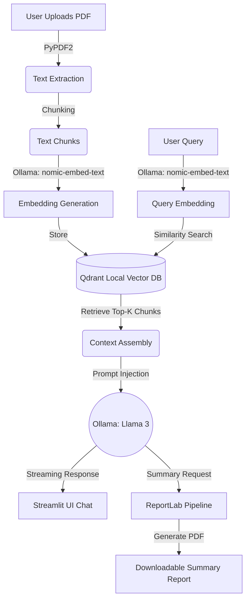

# DocuVault AI 🛡️📄

[](https://opensource.org/licenses/MIT)
[](https://www.python.org/downloads/)
[](https://streamlit.io/)
[](https://ollama.ai/)
[](https://qdrant.tech/)

**DocuVault AI** is a 100% private, offline-local Retrieval-Augmented Generation (RAG) system engineered for secure document intelligence. It enables zero-latency semantic search, conversational Q&A, and automated PDF report generation without ever transmitting sensitive data to external APIs.

---

## ✨ Key Architectural Features

- **Air-Gapped Privacy & Security**: 100% local execution. No cloud APIs, no subscriptions, and zero data leakage, making it ideal for compliance-heavy and enterprise environments.
- **Persistent Disk-Based Vector Indexing**: Utilizes **Qdrant** locally to store and rapidly retrieve high-dimensional document embeddings, ensuring fast and persistent semantic search.
- **Local Semantic Search & QA**: Powered by **Ollama** running the state-of-the-art **Llama 3** model for intelligent, context-aware answers, and `nomic-embed-text` for precise text vectorization.
- **Automated Summary Exports**: Dynamically generates polished, comprehensive PDF summary reports of document insights using **ReportLab**, available for instant download.

---

## 🏗️ System Architecture



---

## 📋 Prerequisites

Ensure your system meets the following requirements before installation:

- **Python**: Version `3.9` or higher.
- **Ollama**: Installed and running on your host machine. ([Download Ollama](https://ollama.ai/download))

**Required Local Models:**
Before running the application, pull the necessary language and embedding models via the Ollama CLI:

```bash
# Pull Llama 3 for the LLM reasoning and QA
ollama pull llama3

# Pull Nomic Embed Text for vector generation
ollama pull nomic-embed-text
```

---

## 🚀 Quick Start / Installation Guide

Follow these steps to set up the environment and run DocuVault AI locally:

**1. Clone the repository**
```bash
git clone https://github.com/yourusername/docuvault-ai.git
cd docuvault-ai
```

**2. Set up a Python Virtual Environment**
```bash
# Create a virtual environment
python -m venv venv

# Activate the virtual environment
# On Windows:
venv\Scripts\activate
# On macOS/Linux:
source venv/bin/activate
```

**3. Install Dependencies**
```bash
pip install --upgrade pip
pip install -r requirements.txt
```

**4. Run the Application**
```bash
python -m streamlit run app.py
```
*The Streamlit application will automatically open in your default web browser at `http://localhost:8501`.*

---

## 📁 Project Structure

```text
docuvault-ai/
├── app.py                # Main Streamlit application and RAG pipeline logic
├── requirements.txt      # Python dependencies (Streamlit, Qdrant, Ollama, ReportLab, etc.)
├── README.md             # Project documentation
└── qdrant_storage/       # Auto-generated directory for local Qdrant vector database persistence
```

---

## 🤝 Contributing

Contributions are welcome! If you'd like to improve DocuVault AI, please feel free to fork the repository, create a feature branch, and submit a pull request. 

1. Fork the Project
2. Create your Feature Branch (`git checkout -b feature/AmazingFeature`)
3. Commit your Changes (`git commit -m 'Add some AmazingFeature'`)
4. Push to the Branch (`git push origin feature/AmazingFeature`)
5. Open a Pull Request

---

## 📜 License

Distributed under the MIT License. See `LICENSE` for more information.

---
*Built with ❤️ for secure, offline document intelligence.*
